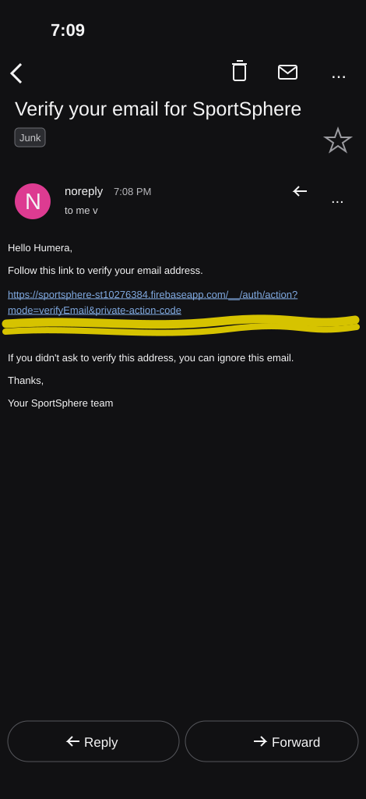

# SportSphere

SportSphere is a native Android sports companion application built for PROG7314 / OPSC7312 Part 2. It gives athletes one place to choose a sport, view events, record sport-specific performance, follow monthly progress, read learning material, and manage their account.

The Android application uses Firebase Authentication and communicates with a custom Node.js REST API. The production API is hosted on Render, while application data is stored in Azure Cosmos DB.

| Project detail | Value |
| --- | --- |
| Android package | `com.example.prog7314_part2` |
| Mobile platform | Native Android (Kotlin) |
| Minimum Android version | API 24 / Android 7.0 |
| Target SDK | 36 |
| Production API | <https://sportsphere-st10276384.onrender.com/> |
| API health check | <https://sportsphere-st10276384.onrender.com/health> |
| Repository | <https://github.com/humeramathia/Prog7314_Part2> |

> SportSphere is not an Expo or React Native project. The mobile client in `app/` is a native Kotlin Android application.

## Table of contents

- [Overview](#overview)
- [Main features](#main-features)
- [Technology stack](#technology-stack)
- [System architecture](#system-architecture)
- [Folder structure](#folder-structure)
- [Prerequisites](#prerequisites)
- [Configuration](#configuration)
- [How to run the project](#how-to-run-the-project)
  - [Run the API locally](#run-the-api-locally)
  - [Run the Android app on an emulator](#run-the-android-app-on-an-emulator)
  - [Run the Android app on a physical device](#run-the-android-app-on-a-physical-device)
- [Physical-device implementation](#physical-device-implementation)
- [Firebase authentication and email verification](#firebase-authentication-and-email-verification)
- [REST API](#rest-api)
- [Render hosting](#render-hosting)
- [Azure](#azure)
- [Testing and continuous integration](#testing-and-continuous-integration)
- [Troubleshooting](#troubleshooting)
- [Security notes](#security-notes)

## Overview

SportSphere is split into two applications:

1. `app/` is the Android client. It contains the screens, navigation, Firebase sign-in, Retrofit networking, local session preferences, and Android-specific integrations.
2. `api/` is the Express REST API. It validates Firebase ID tokens, applies business rules, and reads or writes data in Azure Cosmos DB.

The normal user journey is:

1. Register with an email and password, or sign in with Google.
2. Verify the email address when email/password registration is used.
3. Select a sport.
4. Use the Home, Calendar, Performance, and Learn sections.
5. Open Settings from Home to update preferences or sign out.

The application uses sport-specific performance fields instead of one generic score. For example, a basketball record can contain points and rebounds, while swimming can use distance and time. The API sends each sport's metric schema to the app so the performance form and graph can use the correct measurements.

## Main features

### Authentication and account management

- Email/password registration and login through Firebase Authentication
- Google sign-in through Android Credential Manager
- Email verification before an email/password account can enter the app
- Firebase ID tokens attached to protected API requests
- Local session protection and account-aware sport selection
- Logout and dark-mode preferences in Settings

### Sport selection

- A catalog of six supported sports is loaded from the API
- Each sport defines its own performance metrics
- A local `FakeRepository` provides a fallback sport list if the API is temporarily unavailable

### Calendar

- Sport-specific events
- Event types: `PRACTICE`, `SOCIAL_EVENT`, and `ANNOUNCEMENT`
- Event detail screen
- Add an event to the phone's calendar with Android's calendar insert intent

### Performance

- Add and remove personal performance sessions
- Store sport-specific metrics and optional notes
- View previous sessions
- Display monthly data in a custom bar chart

### Learn

- Learning material filtered by sport
- Categories: `RULES`, `TECHNIQUES`, `TRAINING`, and `SAFETY`
- Support for image or video links through `mediaUrl`

## Technology stack

| Layer | Technologies |
| --- | --- |
| Android client | Kotlin, AndroidX, Material Components, Navigation Component, ViewBinding |
| Networking | Retrofit 2.11, OkHttp 4.12, Gson |
| Authentication | Firebase Authentication, Firebase Admin SDK, Google Credential Manager |
| Images | Glide |
| API | Node.js 20, Express 4, CORS, dotenv |
| Database | Azure Cosmos DB |
| Production hosting | Render |
| Optional API hosting | Azure App Service |
| Testing | JUnit, Jest, SuperTest |
| CI | GitHub Actions |

## System architecture

```text
Physical Android phone (release build)
        |
        | HTTPS + Firebase Bearer token
        v
Render: SportSphere Express API
        |
        | Firebase Admin verifies the token
        |
        +---------------------------> Azure Cosmos DB
                                        users
                                        sports
                                        events
                                        performance
                                        learning
```

For local development, the Android emulator uses `10.0.2.2`, Android's special alias for the host computer:

```text
Android emulator (debug build)
        |
        | HTTP http://10.0.2.2:3000/
        v
Node.js API running on the development computer
```

The app follows a single-activity structure. `MainActivity` hosts Navigation Component fragments and the bottom navigation bar. Retrofit provides typed API calls, while an OkHttp interceptor obtains the current Firebase ID token and adds it to requests.

## Folder structure

Generated directories such as `.gradle/`, `.idea/`, `app/build/`, and `api/node_modules/` are omitted.

```text
Prog7314_Part2/
├── README.md
├── render.yaml                       # Render production service
├── firebase.json
├── .firebaserc                       # Firebase project selection
├── build.gradle.kts                  # Root Android build configuration
├── settings.gradle.kts
├── gradle.properties
├── gradlew / gradlew.bat             # Gradle wrapper
├── gradle/
│   ├── libs.versions.toml
│   └── wrapper/
├── .github/
│   ├── dependabot.yml
│   └── workflows/
│       ├── android.yml               # Android tests and debug build
│       └── api.yml                   # API Jest tests
├── docs/
│   └── images/
│       └── email-verification.svg
├── app/                              # Native Android application
│   ├── build.gradle.kts              # SDKs, dependencies, API URLs
│   ├── proguard-rules.pro
│   └── src/
│       ├── main/
│       │   ├── AndroidManifest.xml
│       │   ├── java/com/example/prog7314_part2/
│       │   │   ├── MainActivity.kt
│       │   │   ├── SportSphereApp.kt
│       │   │   ├── data/
│       │   │   │   ├── Models.kt
│       │   │   │   ├── SessionPrefs.kt
│       │   │   │   ├── SportMetrics.kt
│       │   │   │   ├── FakeRepository.kt
│       │   │   │   └── remote/
│       │   │   │       ├── ApiClient.kt
│       │   │   │       ├── ApiModels.kt
│       │   │   │       ├── FirebaseAuthInterceptor.kt
│       │   │   │       ├── Mappers.kt
│       │   │   │       └── SportSphereApi.kt
│       │   │   └── ui/
│       │   │       ├── auth/
│       │   │       ├── home/
│       │   │       ├── calendar/
│       │   │       ├── performance/
│       │   │       ├── learn/
│       │   │       └── settings/
│       │   └── res/
│       │       ├── layout/
│       │       ├── navigation/nav_graph.xml
│       │       ├── menu/menu_bottom_nav.xml
│       │       └── xml/network_security_config.xml
│       ├── test/                      # Local JUnit tests
│       └── androidTest/               # Instrumented Android tests
└── api/                              # Node.js REST API
    ├── package.json
    ├── .env.example
    ├── Procfile
    ├── jest.config.js
    ├── deploy-azure.ps1              # Optional Azure App Service deployment
    ├── src/
    │   ├── server.js
    │   ├── app.js
    │   ├── config.js
    │   ├── firebase.js
    │   ├── seed.js
    │   ├── auth/
    │   ├── middleware/
    │   ├── routes/
    │   ├── pages/
    │   ├── data/
    │   └── store/
    │       ├── index.js
    │       ├── memoryStore.js
    │       └── cosmosStore.js
    └── tests/
```

## Prerequisites

Install the following before running the project:

- Android Studio with Android SDK 36
- JDK 11 or newer; GitHub Actions uses JDK 21
- Node.js 20.x and npm
- Git
- A Firebase Android configuration file named `google-services.json`
- Android Platform Tools/ADB when installing from the command line

For deployment rather than local development:

- A Render account for the production API
- An Azure account and Cosmos DB account
- Azure CLI for the optional App Service deployment script
- A Firebase service-account JSON for server-side token verification

## Configuration

### Android Firebase configuration

Download `google-services.json` from Firebase Console and place it here:

```text
app/google-services.json
```

The Firebase Android app must use:

```text
Package name: com.example.prog7314_part2
Project ID:   sportsphere-st10276384
```

The file is gitignored because it belongs to a specific Firebase project.

### API environment

Create the local API environment file in PowerShell:

```powershell
Copy-Item api\.env.example api\.env
```

Important variables include:

| Variable | Purpose |
| --- | --- |
| `PORT` | Express port; defaults to `3000` |
| `HOST` | Bind address; the server defaults to `0.0.0.0` |
| `NODE_ENV` | Development or production environment |
| `SKIP_AUTH` | Local-only authentication bypass |
| `DEV_USER_ID`, `DEV_USER_EMAIL`, `DEV_USER_NAME` | Development identity used by the bypass |
| `COSMOS_ENDPOINT` | Azure Cosmos DB account endpoint |
| `COSMOS_KEY` | Azure Cosmos DB access key |
| `COSMOS_DATABASE` | Cosmos database name; normally `sportsphere` |
| `GOOGLE_APPLICATION_CREDENTIALS` | Local path to a Firebase service-account file |
| `FIREBASE_SERVICE_ACCOUNT` | Inline service-account JSON used by hosted environments |
| `FIREBASE_PROJECT_ID` | Firebase project used to verify tokens |
| `FIREBASE_WEB_API_KEY` | Used by the email-verification page and API fallback |

`API_PUBLIC_URL` appears in `.env.example` for documentation, but the current application does not read it. Android API URLs are generated from `app/build.gradle.kts`.

For an easy local API run, keep:

```dotenv
SKIP_AUTH=true
```

Never enable `SKIP_AUTH` in a public or production deployment.

If a valid `COSMOS_KEY` is not configured locally, the API uses its in-memory store. This is useful for development, but data disappears when the Node process restarts.

## How to run the project

### Run the API locally

From the repository root:

```powershell
Set-Location api
Copy-Item .env.example .env
npm install
npm test
npm start
```

For automatic restarts while editing:

```powershell
npm run dev
```

To seed a configured Cosmos database manually:

```powershell
npm run seed
```

Check that the API started:

```powershell
Invoke-RestMethod http://localhost:3000/health
```

An expected development response resembles:

```json
{
  "ok": true,
  "service": "sportsphere-api",
  "version": "1.0.0",
  "store": "memory",
  "skipAuth": true,
  "firebaseAdmin": false
}
```

`store` changes to `cosmos` when valid Cosmos credentials are available.

### Run the Android app on an emulator

1. Start the local API with `npm start`.
2. Place `google-services.json` in `app/`.
3. Open the repository in Android Studio.
4. Open **Build → Select Build Variant** and choose `debug`.
5. Start an Android emulator.
6. Select the emulator in the device list and click **Run**.

The debug build uses:

```text
http://10.0.2.2:3000/
```

Do not replace `10.0.2.2` with `localhost`. Inside an emulator, `localhost` means the emulator itself, while `10.0.2.2` routes to the development computer.

Useful Gradle commands:

```powershell
.\gradlew.bat testDebugUnitTest
.\gradlew.bat assembleDebug
```

The debug APK is produced at:

```text
app/build/outputs/apk/debug/app-debug.apk
```

### Run the Android app on a physical device

The physical-device build uses the hosted Render API, so the phone and development computer do not have to share a local network.

#### Before connecting the device

1. Open <https://sportsphere-st10276384.onrender.com/health> to wake the Render service.
2. Confirm that the response contains `"ok": true`.
3. Place the correct `google-services.json` in `app/`.
4. On the phone, enable **Developer options** and **USB debugging**.
5. Connect the phone with a data-capable USB cable.
6. Accept the RSA debugging prompt on the phone.

#### Android Studio

1. Open **Build → Select Build Variant**.
2. Select the `release` variant for `app`.
3. Choose the physical phone in the device selector.
4. Click **Run**.

#### Command line

From the repository root:

```powershell
# Confirm that the hosted service is available
Invoke-RestMethod https://sportsphere-st10276384.onrender.com/health

# Build the signed coursework release APK
.\gradlew.bat assembleRelease

# Confirm that ADB can see the phone
adb devices

# Install or update SportSphere
adb install -r app\build\outputs\apk\release\app-release.apk
```

On macOS or Linux, use:

```bash
curl https://sportsphere-st10276384.onrender.com/health
./gradlew assembleRelease
adb devices
adb install -r app/build/outputs/apk/release/app-release.apk
```

The APK is created at:

```text
app/build/outputs/apk/release/app-release.apk
```

> Use the `release` build on a physical device. The current `debug` build points to `10.0.2.2`, which is an emulator-only host alias.

## Physical-device implementation

Running on a phone required more than producing an APK. The app must use a network address the phone can reach, request internet access, use the correct transport security, authenticate hosted requests, and produce an installable signed package.

### 1. Build-specific API addresses

`app/build.gradle.kts` creates `BuildConfig.API_BASE_URL` with a different value for each build type:

```kotlin
buildTypes {
    debug {
        buildConfigField(
            "String",
            "API_BASE_URL",
            "\"http://10.0.2.2:3000/\""
        )
    }
    release {
        isMinifyEnabled = false
        signingConfig = signingConfigs.getByName("debug")
        buildConfigField(
            "String",
            "API_BASE_URL",
            "\"https://sportsphere-st10276384.onrender.com/\""
        )
    }
}
```

This distinction is essential:

- `10.0.2.2` is provided by the Android emulator and points back to the computer running the emulator.
- A physical device cannot use `10.0.2.2` to reach that computer.
- The release build therefore uses the public Render HTTPS URL.

No URL has to be entered by the user. Gradle places the correct value in the generated `BuildConfig` class when it builds the selected variant.

### 2. Retrofit consumes the generated URL

`ApiClient.kt` passes the generated value to Retrofit:

```kotlin
val service: SportSphereApi by lazy {
    Retrofit.Builder()
        .baseUrl(BuildConfig.API_BASE_URL)
        .client(httpClient)
        .addConverterFactory(GsonConverterFactory.create())
        .build()
        .create(SportSphereApi::class.java)
}
```

All interface paths in `SportSphereApi.kt`, such as `api/me` and `api/performance`, are relative to this base URL. Selecting `release` therefore redirects the complete API client to Render.

The OkHttp client uses 15-second connect, read, and write timeouts. These allow a reasonable amount of time for a free Render service to wake up without leaving the interface waiting indefinitely.

### 3. Android internet permission

`AndroidManifest.xml` grants the application network access:

```xml
<uses-permission android:name="android.permission.INTERNET" />
```

`INTERNET` is a normal Android permission, so the user is not shown a runtime permission dialog.

### 4. Network security

The application links its network policy in `AndroidManifest.xml`:

```xml
<application
    android:networkSecurityConfig="@xml/network_security_config"
    android:usesCleartextTraffic="true"
    ... >
```

The intended policy in `network_security_config.xml` is to reject cleartext traffic by default and permit the local HTTP endpoint only during debugging:

```xml
<network-security-config>
    <base-config cleartextTrafficPermitted="false" />
    <debug-overrides>
        <base-config cleartextTrafficPermitted="true" />
    </debug-overrides>
</network-security-config>
```

Production device traffic uses `https://sportsphere-st10276384.onrender.com/`, so credentials and Firebase tokens are encrypted in transit.

### 5. Firebase token authentication

The production API has `SKIP_AUTH=false`. Every protected request from the phone must therefore include a valid Firebase ID token.

`FirebaseAuthInterceptor.kt` obtains the current token on OkHttp's background thread:

```kotlin
val token = Tasks.await(
    user.getIdToken(false),
    15,
    TimeUnit.SECONDS
).token

val authenticatedRequest = chain.request()
    .newBuilder()
    .header("Authorization", "Bearer $token")
    .build()
```

The resulting request has this form:

```http
Authorization: Bearer <firebase-id-token>
```

The Express `requireAuth` middleware verifies the token with Firebase Admin. It then makes the verified user identity available to routes so records such as performance sessions can be scoped to the correct user.

### 6. The API listens on a hosted interface

The Node server uses the platform's port and binds to all interfaces:

```javascript
const host = process.env.HOST || "0.0.0.0";
app.listen(config.port, host, () => {
  // Server ready
});
```

Binding to `0.0.0.0` is required on hosted platforms. Binding only to `localhost` would make the process unavailable to Render's public routing layer.

### 7. Installable release signing

The coursework release currently uses Android's debug keystore:

```kotlin
signingConfig = signingConfigs.getByName("debug")
```

This makes `app-release.apk` installable on a demonstration phone without storing a private production keystore in the repository.

This signing choice is appropriate for a class demonstration only. A Play Store release must use a securely managed release key and should not use the debug keystore.

### 8. Physical-device request path

After installation, a protected request follows this sequence:

```text
Screen/Fragment
  → SportSphereApi Retrofit method
  → FirebaseAuthInterceptor
  → BuildConfig.API_BASE_URL
  → HTTPS request to Render
  → Firebase Admin token verification
  → Route handler
  → Azure Cosmos DB
  → JSON response
  → Retrofit/Gson model
  → Android screen
```

This design removes the phone's dependency on the development computer. Once the release APK is installed and the Render service is available, the app only requires an internet connection.

## Firebase authentication and email verification

### Registration flow

`RegisterFragment.kt` validates the form, creates the Firebase account, updates the display name, sends the verification email, and opens the confirmation screen:

```kotlin
auth.createUserWithEmailAndPassword(email, password)
    .addOnCompleteListener { result ->
        val user = result.result?.user ?: return@addOnCompleteListener
        user.updateProfile(profile)
            .addOnCompleteListener {
                EmailVerification.send(user) { _, message ->
                    findNavController().navigate(
                        R.id.action_register_to_confirm,
                        Bundle().apply { putString("email", email) }
                    )
                }
            }
    }
```

The app does not treat account creation as full access. Login and session checks require `isEmailVerified` for email/password users.

### Creating the verification link

`EmailVerification.kt` defines the Render landing page and the Android package that can handle the result:

```kotlin
const val VERIFY_URL =
    "https://sportsphere-st10276384.onrender.com/verify-email"

val settings = ActionCodeSettings.newBuilder()
    .setUrl(VERIFY_URL)
    .setHandleCodeInApp(false)
    .setAndroidPackageName(
        "com.example.prog7314_part2",
        false,
        null
    )
    .build()

user.sendEmailVerification(settings)
```

Firebase sends the user an email similar to the following:

<p align="center">
  
</p>

The screenshot hides the private one-time action code. Verification links should be treated as temporary sensitive links and should not be shared.

### Rate-limit fallback

Repeated verification requests can trigger a Firebase device-level rate limit. SportSphere first calls `FirebaseUser.sendEmailVerification()`. If Firebase reports a rate-limit error, the app calls:

```http
POST /api/auth/send-verification
Authorization: Bearer <firebase-id-token>
```

The API forwards the request to Google Identity Toolkit using the authenticated user's ID token. The confirmation screen also applies a 60-second resend cooldown to prevent accidental repeated requests.

### Confirming verification

The confirmation screen provides three actions:

- **Open email app** launches the device's default mail application.
- **Resend email** sends another link after the cooldown.
- **I have confirmed** refreshes the token, reloads the Firebase user, and checks `isEmailVerified`.

The refresh deliberately forces a new ID token before reloading:

```kotlin
user.getIdToken(true)
    .continueWithTask {
        FirebaseAuth.getInstance().currentUser!!.reload()
    }
```

When verification succeeds, the local session is created and the user is sent to Sport Select or Home.

### Browser page and Android deep links

There are two supported completion paths:

1. The link opens `/verify-email`, whose hosted page applies the Firebase `oobCode`. The user returns to SportSphere and taps **I have confirmed**.
2. Android opens the verification URL directly in SportSphere. `MainActivity` passes the URI to `EmailVerification.applyCodeFrom`, which calls `FirebaseAuth.applyActionCode`.

The manifest registers both the Render verification URL and Firebase's standard action URL:

```xml
<data
    android:scheme="https"
    android:host="sportsphere-st10276384.onrender.com"
    android:pathPrefix="/verify-email" />

<data
    android:scheme="https"
    android:host="sportsphere-st10276384.firebaseapp.com"
    android:pathPrefix="/__/auth/action" />
```

`MainActivity` uses `launchMode="singleTop"` and handles both the first launch and a new intent:

```kotlin
override fun onNewIntent(intent: Intent) {
    super.onNewIntent(intent)
    setIntent(intent)
    handleEmailLink(intent)
}

private fun handleEmailLink(intent: Intent?) {
    EmailVerification.applyCodeFrom(intent?.data) { _, message ->
        Toast.makeText(this, message, Toast.LENGTH_LONG).show()
    }
}
```

## REST API

### Base addresses

| Environment | Base URL |
| --- | --- |
| Local computer | `http://localhost:3000/` |
| Android emulator | `http://10.0.2.2:3000/` |
| Production | `https://sportsphere-st10276384.onrender.com/` |

### Authentication

Except for the health and email-action pages, API routes require:

```http
Authorization: Bearer <Firebase ID token>
```

When `SKIP_AUTH=false`:

- A missing token returns `401`.
- An invalid or expired token returns `401`.
- Missing Firebase Admin configuration returns `503`.

When local `SKIP_AUTH=true`, the middleware uses the configured development identity. This mode must never be exposed publicly.

### Public endpoints

| Method | Endpoint | Purpose |
| --- | --- | --- |
| `GET` | `/health` | Service, store, auth, and Firebase status |
| `GET` | `/verify-email` | Hosted Firebase email-verification page |
| `GET` | `/auth/action` | Alternate route to the same verification page |
| `GET` | `/verified` | Verification-success page |

### Authentication endpoint

| Method | Endpoint | Purpose |
| --- | --- | --- |
| `POST` | `/api/auth/send-verification` | Authenticated fallback for sending a verification email |

### Profile endpoints

| Method | Endpoint | Purpose |
| --- | --- | --- |
| `GET` | `/api/me` | Get or create the signed-in user's profile |
| `PATCH` | `/api/me` | Update display name, selected sport, or dark mode |

### Sport endpoints

| Method | Endpoint | Purpose |
| --- | --- | --- |
| `GET` | `/api/sports` | List the sport catalog and metric schemas |
| `GET` | `/api/sports/:sportId` | Get one sport |

### Event endpoints

| Method | Endpoint | Purpose |
| --- | --- | --- |
| `GET` | `/api/events?sportId=&from=&to=` | List events for a sport and optional period |
| `GET` | `/api/events/next?sportId=` | Get the next event or most recent event |
| `GET` | `/api/events/:eventId` | Get event details |
| `POST` | `/api/events` | Create an event |
| `PUT` | `/api/events/:eventId` | Update an event |
| `DELETE` | `/api/events/:eventId` | Delete an event |

The Android interface currently reads events. Event create, update, and delete routes are available on the API but are not exposed through the current mobile UI.

### Performance endpoints

| Method | Endpoint | Purpose |
| --- | --- | --- |
| `GET` | `/api/performance?sportId=` | List the current user's sessions |
| `GET` | `/api/performance/:sessionId` | Get one owned session |
| `POST` | `/api/performance` | Add a session |
| `DELETE` | `/api/performance/:sessionId` | Delete an owned session |
| `GET` | `/api/performance/monthly?sportId=&year=&month=&metric=` | Get monthly chart data |

Example performance request:

```json
{
  "sportId": "basketball",
  "recordedAt": 1789228800000,
  "notes": "Home fixture",
  "metrics": {
    "points": 22,
    "rebounds": 8
  }
}
```

Performance data is user-scoped. The API uses the verified Firebase user ID rather than trusting a user ID sent in the request body.

### Learning endpoints

| Method | Endpoint | Purpose |
| --- | --- | --- |
| `GET` | `/api/learn?sportId=&category=` | List learning cards |
| `GET` | `/api/learn/:guideId` | Get one learning item |

## Render hosting

Render is the primary production host used by the Android release build.

The root `render.yaml` Blueprint defines:

```yaml
services:
  - type: web
    name: sportsphere-st10276384
    runtime: node
    plan: free
    region: oregon
    rootDir: api
    buildCommand: npm install
    startCommand: node src/server.js
    healthCheckPath: /health
    autoDeploy: true
```

Render performs the following:

1. Uses `api/` as the service root.
2. Installs npm dependencies.
3. Starts `node src/server.js`.
4. Checks `/health` to determine service health.
5. Automatically deploys repository changes.
6. Injects production environment variables.

The Blueprint fixes `SKIP_AUTH` to `"false"`. `COSMOS_ENDPOINT`, `COSMOS_KEY`, and `FIREBASE_SERVICE_ACCOUNT` are marked `sync: false`, which means their secret values must be entered in the Render dashboard and are not stored in the repository.

Because the service uses the free plan, it may sleep after inactivity. If the first app request fails or takes longer than normal, open the health URL, wait for a successful response, and retry in the app.

## Azure

SportSphere uses Azure in two separate ways.

### Azure Cosmos DB

Cosmos DB is the production data store, even when the API itself runs on Render. `api/src/store/cosmosStore.js` creates the database and containers when necessary.

| Container | Partition key | Stores |
| --- | --- | --- |
| `users` | `/userId` | Profiles, selected sport, preferences |
| `sports` | `/sportId` | Sport catalog and metric definitions |
| `events` | `/sportId` | Calendar events |
| `performance` | `/userId` | User performance sessions |
| `learning` | `/sportId` | Learning content |

Partition keys match the most common query boundary. User-owned performance data is partitioned by user, while sport content is partitioned by sport.

At startup, the API checks whether sports exist and seeds the catalog when needed. A configured database can also be seeded explicitly with:

```powershell
Set-Location api
npm run seed
```

### Optional Azure App Service deployment

`api/deploy-azure.ps1` is an alternative deployment path for the Express API. It:

1. Creates resource group `prog7314-rg`.
2. Creates a Linux B1 App Service plan.
3. Creates the `sportsphere-st10276384` web app.
4. Selects the Node 20 LTS runtime.
5. sets `node src/server.js` as the startup command.
6. Reads Cosmos values from `api/.env`.
7. Adds the Firebase service account when the local JSON file exists.
8. Creates a deployment ZIP and uploads it with Azure CLI.

Run it after installing Azure CLI and authenticating:

```powershell
az login
powershell -File api\deploy-azure.ps1
```

Its health URL is:

```text
https://sportsphere-st10276384.azurewebsites.net/health
```

The Android release build currently points to Render, not Azure App Service. Changing hosting providers requires changing the release `API_BASE_URL` and rebuilding the APK.

> Configuration note: `api/deploy-azure.ps1` currently sets `FIREBASE_PROJECT_ID=sportsphere-b3c84`, while the Android app, `.firebaserc`, and Render use `sportsphere-st10276384`. Correct that setting before using Azure App Service for the current Firebase project.

## Testing and continuous integration

### API tests

```powershell
Set-Location api
npm install
npm test
```

Jest and SuperTest test the Express routes. The API GitHub Actions workflow runs tests with local authentication bypassed.

### Android tests and builds

From the repository root:

```powershell
.\gradlew.bat testDebugUnitTest
.\gradlew.bat assembleDebug
```

The Android workflow runs unit tests and creates a debug APK. Unit tests cover areas including metrics, mappers, learning support, and the fallback repository.

## Troubleshooting

### The phone cannot load data

- Confirm that the installed app is the `release` build.
- Open the Render health check and wait for `"ok": true`.
- Confirm that the phone has internet access.
- Confirm that Firebase sign-in completed successfully.
- Reinstall the latest release APK if the base URL changed.

### The emulator cannot reach the local API

- Confirm that `npm start` is running in `api/`.
- Use `http://10.0.2.2:3000/`, not `localhost`, from Android.
- Confirm that the `debug` build variant is selected.
- Check whether a firewall is blocking Node.js.

### API returns 401

- Sign out and sign in again to refresh the Firebase session.
- Confirm that the app and API use the same Firebase project.
- Confirm that `FirebaseAuthInterceptor` is attaching the token.
- For local development only, confirm whether `SKIP_AUTH=true` is intended.

### API returns 503 for authentication

Firebase Admin is not configured on the server. Add either:

- `GOOGLE_APPLICATION_CREDENTIALS` pointing to a local service-account file, or
- `FIREBASE_SERVICE_ACCOUNT` containing the service-account JSON in the hosted environment.

### Verification email is missing

- Check Spam or Junk.
- Wait 60 seconds before resending.
- Open the link in Chrome if an in-app mail browser does not complete the action.
- Return to SportSphere and tap **I have confirmed**.

### `adb devices` shows `unauthorized`

Unlock the phone, accept the RSA prompt, and run `adb devices` again. If no prompt appears, revoke USB debugging authorizations in Developer options and reconnect the cable.

## Security notes

Never commit:

```text
api/.env
api/firebase-service-account.json
app/google-services.json
Cosmos DB keys
Private Android release keystores
```

Additional safeguards:

- Keep `SKIP_AUTH=false` in every hosted environment.
- Rotate a Cosmos key immediately if it is exposed.
- Store Render and Azure secrets in their platform settings.
- Use HTTPS for every production API request.
- Use the debug keystore only for coursework/demo installation.
- Do not publish verification links because they contain one-time action codes.
